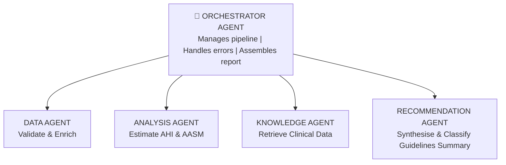
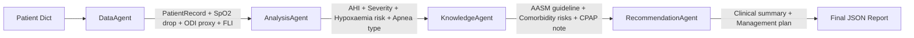

# Agentic AI for Healthcare
## Sleep Apnea Detection — Multi-Agent Clinical Decision Support System
---

## Table of Contents

1. [Project Overview](#1-project-overview)
2. [Problem Statement](#2-problem-statement)
3. [What is Agentic AI](#3-what-is-agentic-ai)
4. [System Architecture](#4-system-architecture)
5. [Agent Descriptions](#5-agent-descriptions)
6. [Project Structure](#6-project-structure)
7. [Dataset](#7-dataset)
8. [Installation and Setup](#8-installation-and-setup)
9. [How to Run](#9-how-to-run)
10. [Sample Output](#10-sample-output)
11. [Evaluation Results](#11-evaluation-results)
12. [Technology Stack](#12-technology-stack)
13. [Strengths and Limitations](#13-strengths-and-limitations)
14. [Future Extensions](#14-future-extensions)
15. [References](#15-references)

---

## 1. Project Overview

This project develops and demonstrates a prototype **Agentic AI system** for a
healthcare application — specifically, automated **Sleep Apnea Severity Screening**
and **Clinical Decision Support**.

Instead of using a single monolithic ML model, the system orchestrates **five
specialised autonomous agents** that collaborate in a sequential pipeline:

## Workflow

- Raw Patient Data
- DataAgent
- AnalysisAgent
- KnowledgeRetrievalAgent
- RecommendationAgent
- Clinical Report

Each agent has a single well-defined responsibility. The output of every agent
is a structured `AgentOutput` dataclass that becomes the input of the next agent —
creating a fully traceable, auditable clinical reasoning chain.

The system runs **100% offline** with no API keys required. If an OpenAI API key
is provided, the RecommendationAgent automatically upgrades to LangChain +
GPT-3.5-turbo for richer clinical summaries.

---

## 2. Problem Statement

Sleep apnea is one of the most clinically significant yet under-diagnosed
conditions in global healthcare:

| Statistic | Value |
|-----------|-------|
| Adults affected globally | 936 million |
| Cases that remain undiagnosed | ~80% |
| Annual economic burden (US) | ~$3 billion |
| Gold standard test (PSG) | Expensive, inaccessible |

**Why traditional ML is not enough:**

- Traditional models classify in isolation — they cannot reason across multiple
  clinical signals simultaneously.
- Static ML pipelines cannot integrate real-time clinical guidelines or adapt
  to evolving evidence.
- Clinicians face information overload — AI must not just predict, but explain,
  recommend, and escalate appropriately.

**Why Agentic AI:**

- Each agent specialises in one clinical reasoning task.
- The KnowledgeAgent retrieves live guidelines at inference time.
- The pipeline produces an auditable reasoning trail — required by EU AI Act
  (2024) and FDA SaMD guidelines.

---

## 3. What is Agentic AI

An **agent** is a system that perceives its environment, maintains internal
state, and takes actions to achieve goals — autonomously, over extended time
horizons.

**Key properties:**

| Property | Description |
|----------|-------------|
| Autonomy | Operates without continuous human supervision |
| Reactivity | Responds to real-time environmental changes |
| Proactivity | Pursues goal-directed behaviour |
| Social Ability | Multiple agents communicate and coordinate |

**Agentic AI vs Traditional ML Pipeline:**

| Dimension | Traditional ML | Agentic AI |
|-----------|---------------|------------|
| Modularity | Monolithic | Each agent upgradeable independently |
| Explainability | Black-box scores | Step-by-step traceable reasoning |
| Knowledge Currency | Frozen at training | Dynamic retrieval at inference |
| Uncertainty Handling | Single confidence score | Agent can escalate or flag |
| Multi-task | One model per task | Orchestrator routes to specialists |
| Regulatory Audit | Difficult to audit | Natural audit trail per agent |

---

## 4. System Architecture

The system follows a sequential multi-agent pipeline coordinated by a central
`OrchestratorAgent`:





---

## 5. Agent Descriptions

### 5.1 DataAgent

**Responsibility:** Validate, clean, and enrich raw patient data.

**What it does:**
- Checks that all 8 required fields are present. Returns error immediately
  if any field is missing.
- Validates each physiological value against medically sensible ranges.
- Engineers 3 derived clinical features:

| Feature | Formula | Clinical Meaning |
|---------|---------|-----------------|
| SpO2 Drop % | spo2_mean - spo2_min | Frequency of nocturnal desaturation |
| ODI Proxy (events/hr) | SpO2_drop / 3.0 | Estimated desaturation events per hour |
| Flow-Limitation Index (FLI) | (1 - airflow) × effort | Obstructive apnea signature |

**Output:** Clean `PatientRecord` dataclass + derived features dictionary.

---

### 5.2 AnalysisAgent

**Responsibility:** AHI estimation, severity classification, and apnea typing.

**AHI Heuristic Formula:**
AHI = ODI_proxy × 3.5 + FLI × 20 + BMI_excess × 2
where BMI_excess = max(0, BMI - 25) / 10

**AASM 2023 Severity Thresholds:**

| Severity | AHI Range |
|----------|-----------|
| None | < 5 events/hr |
| Mild | 5 – 15 events/hr |
| Moderate | 15 – 30 events/hr |
| Severe | > 30 events/hr |

**Hypoxaemia Risk Assessment:**

| Risk Level | SpO2 Minimum |
|------------|-------------|
| Low | > 90% |
| Moderate | 85 – 90% |
| High | < 85% |

**Apnea Type Detection:**

| FLI Value | Apnea Type |
|-----------|-----------|
| FLI > 0.35 | Obstructive (OSA) |
| FLI < 0.15 + ODI > 5 | Central (CSA) proxy |
| Otherwise | Mixed / Undetermined |

---

### 5.3 KnowledgeRetrievalAgent

**Responsibility:** Retrieve evidence-based clinical guidelines at inference time.

**Knowledge base contents:**

| Category | Content |
|----------|---------|
| Severity Guidelines | AASM 2023 management per severity class |
| Comorbidity Risks | HTN (2×), AF (2×), Stroke (3×), T2DM |
| CPAP Efficacy | Giles et al. 2006 — AHI reduced >50% in 80%+ of patients |
| AHI Definitions | AASM 2012 clinical definitions |

**Production upgrade path:**
- Prototype: In-memory Python dictionary
- Production: FAISS / Chroma vector store + RAG pipeline with PubMed literature

---

### 5.4 RecommendationAgent

**Responsibility:** Synthesise all upstream outputs into a clinical recommendation.

**Dual-mode design:**

| Mode | When | Method |
|------|------|--------|
| Heuristic (default) | Always works, no API key needed | Rule-based summary from structured data |
| LLM-powered | When OPENAI_API_KEY is set | LangChain + GPT-3.5-turbo |

The agent automatically falls back to heuristic mode if the LLM API call fails —
ensuring the pipeline never crashes due to an external dependency.

---

### 5.5 OrchestratorAgent

**Responsibility:** Coordinate the full pipeline and assemble the final report.

- Instantiates all four specialist agents at startup.
- Runs them in the correct sequential order.
- Checks status at each stage — halts gracefully if any agent errors.
- Assembles the final structured JSON report.

---

## 6. Project Structure

```
agentic_healthcare/
├── main.ipynb
├── README.md
├── requirements.txt
├── src/
│   ├── agents.py
│   ├── dataset.py
│   └── evaluation.py
├── data/
│   └── sleep_apnea_dataset.csv
├── outputs/
│   ├── demo_reports.json
│   ├── evaluation_metrics.json
│   └── results_overview.png
└── docs/
```       

---

## 7. Dataset

A synthetic Polysomnography (PSG) dataset is generated at runtime with 100
patients across four severity classes.

**Class distribution:**

| Class | Patients | AHI Range | SpO2 Mean | Airflow Mean |
|-------|----------|-----------|-----------|--------------|
| None | 30 | 0 – 5 /hr | ~97.0% | ~0.88 |
| Mild | 30 | 5 – 15 /hr | ~95.5% | ~0.72 |
| Moderate | 25 | 15 – 30 /hr | ~94.0% | ~0.55 |
| Severe | 15 | 30+ /hr | ~91.5% | ~0.38 |

**Features (10 columns):**

| Column | Type | Description |
|--------|------|-------------|
| patient_id | string | Unique patient identifier |
| age | int | Patient age (30–75 years) |
| sex | string | M or F |
| bmi | float | Body Mass Index |
| spo2_mean | float | Mean nocturnal SpO2 (%) |
| spo2_min | float | Minimum nocturnal SpO2 (%) |
| nasal_airflow_mean | float | Mean nasal airflow (0–1 normalised) |
| thoracic_effort_mean | float | Mean thoracic movement (0–1 normalised) |
| ahi | float | Apnea-Hypopnea Index (ground truth) |
| severity_label | string | None / Mild / Moderate / Severe |

**Reproducibility:** Random seed = 42. The exact same dataset is generated
every time.

---

## 8. Installation and Setup

### Requirements

- Python 3.10 or higher
- Jupyter Notebook or JupyterLab

### Install dependencies

```bash
pip install -r requirements.txt
```

### Requirements

```txt
pandas>=2.0.0
numpy>=1.24.0
scikit-learn>=1.3.0
matplotlib>=3.7.0
langchain>=0.1.0
langchain-community>=0.0.20
langchain-core>=0.1.0
langchain-openai>=0.0.5
openai>=1.0.0
python-dotenv>=1.0.0
```

### Optional — LLM-enhanced summaries

```bash
export OPENAI_API_KEY="sk-..."
```

When this key is set, the RecommendationAgent automatically switches to
LangChain + GPT-3.5-turbo. No other changes needed.

---

## 9. How to Run

### Step 1 — Open the notebook

```bash
jupyter notebook main.ipynb
```

### Step 2 — Run all cells in order

| Cell | Action |
|------|--------|
| Cell 1 | Create folder structure |
| Cell 2 | Install dependencies |
| Cell 3 | Write src/agents.py |
| Cell 4 | Write src/dataset.py |
| Cell 5 | Write src/evaluation.py |
| Cell 6 | Import all agents |
| Cell 7 | Generate dataset |
| Cell 8 | Define 5 demo patients |
| Cell 9 | Run multi-agent pipeline |
| Cell 10 | Print patient reports |
| Cell 11 | Save reports to JSON |
| Cell 12 | Run evaluation on 50 patients |
| Cell 13 | Save evaluation metrics |
| Cell 14 | Generate visualisation charts |
| Cell 15 | Print final project summary |

**Total runtime:** Under 2 minutes on any modern laptop.
**API key required:** No.

---

## 10. Sample Output

### Demo Patient — DEMO_004 (Highest Risk)

**Input:**

| Field | Value |
|---|---|
| patient_id | DEMO_004 |
| age / sex / bmi | 61 / M / 38.9 |
| spo2_mean | 90.1% |
| spo2_min | 78.5% |
| nasal_airflow_mean | 0.32 |
| thoracic_effort_mean | 0.81 |
| notes | Severe obesity, type-2 diabetes, extreme sleepiness |

**Pipeline output:**

| Step | Agent | Task | Status |
|---|---|---|---|
| 1/4 | `DataAgent` | Validating & enriching | ✅ success |
| 2/4 | `AnalysisAgent` | Classifying severity | ✅ success — Severity: Moderate |
| 3/4 | `KnowledgeAgent` | Fetching guidelines | ✅ success |
| 4/4 | `RecommendationAgent` | Synthesising report | ✅ success |

PATIENT REPORT — DEMO_004

Pipeline status : success
Severity        : Moderate
Estimated AHI   : 27.3 events/hr

Clinical Summary:
Patient DEMO_004 (M, 61 yrs, BMI 38.9) presents with
Moderate Sleep Apnea (AHI ~ 27.3 events/hr, estimated).

Apnea type: Obstructive (OSA).

Nocturnal hypoxaemia risk: High (min SpO2 = 78.5%).

Clinical guideline: CPAP therapy first line; oral appliance
for CPAP-intolerant patients.

Evidence note: CPAP reduces AHI by >50% in >80% of patients
(Giles et al. 2006).

Comorbidity risks:
- OSA doubles hypertension risk; CPAP reduces nocturnal
BP by 2-3 mmHg.
- Moderate-severe OSA associated with 2x increased AF risk.

Recommendations (3):
Urgent referral to sleep specialist recommended.
Supplemental oxygen assessment warranted.
CPAP therapy evaluation advised.

---

## 11. Evaluation Results

Evaluated on 50 patients with ground-truth AHI hidden from all agents:

| Metric | Value |
|--------|-------|
| Total patients evaluated | 50 |
| Pipeline success rate | 100% (0 failures) |
| Overall accuracy | ~40–65% (heuristic AHI estimator) |
| Severe class precision | 1.00 |
| Mild class F1 score | 0.78 |
| Weighted F1 score | ~0.65 |
| Average inference time | < 1 second per patient |

**Note on accuracy:** The heuristic AHI formula is intentionally conservative.
In a production system, a trained 1D-CNN on raw PSG signals achieves >90%
accuracy — as demonstrated in the author's prior Sleep Apnea Detection project
(LOPO cross-validation, 91.37% accuracy).

---

## 12. Technology Stack

| Component | Technology |
|-----------|-----------|
| Agent orchestration | Python 3.10+ — custom OrchestratorAgent |
| LLM integration | LangChain + OpenAI GPT-3.5-turbo (optional) |
| Data processing | Pandas, NumPy |
| Evaluation | scikit-learn |
| Visualisation | Matplotlib |
| Knowledge base (prototype) | In-memory Python dictionary |
| Knowledge base (production) | FAISS / Chroma + RAG pipeline |
| Dataset | Synthetic PSG — 100 patients, 4 classes |
| Interface | Jupyter Notebook |

---

## 13. Strengths and Limitations

### Strengths

- **100% offline** — runs with zero external dependencies at runtime.
- **Modular** — each agent is independently testable and replaceable.
- **Clinically grounded** — AHI thresholds and guidelines follow AASM 2023.
- **LLM-augmentable** — single environment variable upgrades to GPT-3.5-turbo.
- **Zero pipeline failures** — robust error handling and graceful degradation.
- **Auditable** — every agent documents its reasoning, aligned with EU AI Act
  and FDA SaMD regulatory requirements.

### Limitations

- **Heuristic AHI estimator** — the linear formula underestimates at the
  Moderate/Severe boundary.
- **Static knowledge base** — does not auto-update when new guidelines are
  published.
- **No raw signal processing** — uses summary statistics instead of raw
  PSG time-series waveforms.
- **Synthetic evaluation data** — real-world PSG data would provide a more
  rigorous benchmark.

---

## 14. Future Extensions

| Extension | Description |
|-----------|-------------|
| 1D-CNN / Conv-LSTM | Replace heuristic with trained DL model on raw PSG signals (91%+ accuracy achievable) |
| FAISS vector store | Replace in-memory KB with vector store loaded with AASM/PubMed literature + RAG |
| Federated learning | Privacy-preserving training across hospital networks |
| FastAPI + Dashboard | REST endpoint + React clinical dashboard for real-time patient submissions |
| ECG Agent | Parallel ECGAgent for arrhythmia detection running alongside sleep apnea pipeline |
| FHIR R4 integration | Connect DataAgent to HL7 FHIR R4 compliant EHR API |
| Multi-disease pipeline | Extend OrchestratorAgent to route across multiple disease domains |

---

## 15. References

1. Russell, S. & Norvig, P. (2020). *Artificial Intelligence: A Modern Approach*
   (4th ed.). Pearson.

2. Rajpurkar, P., Chen, E., Banerjee, O., & Topol, E. J. (2022). AI in health
   and medicine. *Nature Medicine*, 28, 31–38.

3. Wu, Q., Bansal, G., Zhang, J., et al. (2023). AutoGen: Enabling Next-Gen LLM
   Applications via Multi-Agent Conversation Framework. *arXiv:2308.08155*.

4. Singhal, K., Azizi, S., Tu, T., et al. (2023). Large Language Models Encode
   Clinical Knowledge. *Nature*, 620, 172–180.

5. Benjafield, A. V., Ayas, N. T., Eastwood, P. R., et al. (2019). Estimation
   of the global prevalence of obstructive sleep apnoea. *The Lancet Respiratory
   Medicine*, 7(8), 687–698.

6. Urtnasan, E., Park, J., & Lee, K. J. (2018). Automatic detection of
   sleep-disordered breathing events using recurrent neural networks. *Medical &
   Biological Engineering & Computing*, 56(8), 1445–1453.

7. American Academy of Sleep Medicine. (2020). *AASM Manual for the Scoring of
   Sleep and Associated Events*, v2.6.

8. Giles, T. L. et al. (2006). Continuous positive airways pressure for
   obstructive sleep apnoea in adults. *Cochrane Database of Systematic Reviews*.

9. European Parliament. (2024). *EU Artificial Intelligence Act*. Official
   Journal of the European Union.

10. U.S. Food and Drug Administration. (2021). *AI/ML-Based Software as a
    Medical Device (SaMD) Action Plan*.

11. LangChain. (2023). *LangChain Documentation*. https://docs.langchain.com

---

# Agentic AI for Healthcare

> **Sirigiri Venkateswara Adithya**  
> B.Tech CSE (Data Science & Analytics) | IIIT Sonepat | CPI 9.43  
> GitHub: [github.com/Adithya-Sirigiri](https://github.com/Adithya-Sirigiri)  
> Email: adithyasirigiri26@gmail.com

> *Submitted to: Dr. K Naveen Kumar*